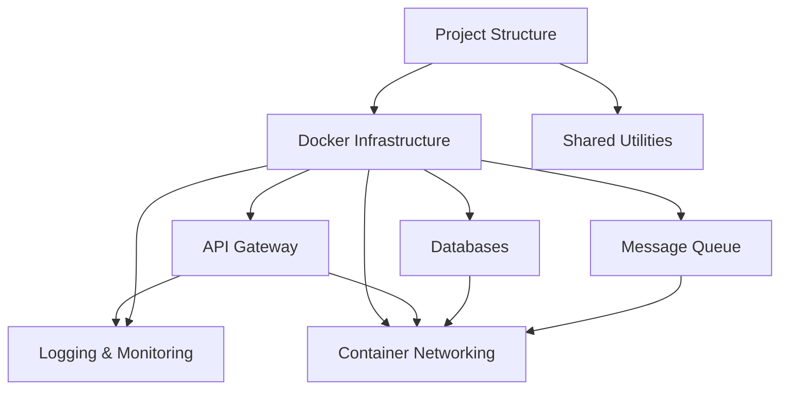

# Phase 1 Scaffolding Sprint Stories

## Overview
These stories cover the initial infrastructure setup for the Grey Literature Search Engine, focusing on Phase 1 priorities from the project roadmap.

## Stories

### Story S1.1: Project Structure and Development Environment
As a developer, I want to set up the initial project structure and development environment so that we can begin building microservices.

Acceptance Criteria:
- Repository initialized with monorepo structure
- Base TypeScript configuration established
- ESLint and Prettier configured
- Docker development environment setup
- Basic README and documentation structure
- .gitignore and other standard configurations

Dependencies: None

Developer Notes:
- Use yarn workspaces for monorepo management
- Follow strict TypeScript configuration
- Include Docker best practices
- Set up consistent code formatting rules

---

### Story S1.2: Base Docker Infrastructure
As a developer, I want to create base Docker images and compose files so that we can containerize our services.

Acceptance Criteria:
- Base Docker images defined for services
- Docker Compose configuration for local development
- Multi-stage build process configured
- Development and production configurations separated
- Container health check mechanisms implemented
- Basic networking between containers established

Dependencies: S1.1

Developer Notes:
- Use minimal base images
- Implement build caching
- Follow security best practices
- Configure proper volume mappings

---

### Story S1.3: API Gateway Setup
As a developer, I want to set up and configure Kong API Gateway so that we can manage service routing and authentication.

Acceptance Criteria:
- Kong Gateway installed and configured
- Basic routing rules established
- Health checks implemented
- Rate limiting configured
- Basic security policies implemented
- Gateway administration API secured

Dependencies: S1.2

Developer Notes:
- Use Kong's official Docker image
- Configure declarative routing
- Implement proper security measures
- Set up monitoring endpoints

---

### Story S1.4: Database Container Setup
As a developer, I want to set up and configure all required database containers so that services can persist data.

Acceptance Criteria:
- MongoDB container configured with proper volumes
- Neo4j container set up with appropriate configuration
- Pinecone connection configuration established
- Database health checks implemented
- Backup volumes configured
- Basic security measures implemented

Dependencies: S1.2

Developer Notes:
- Use official database images
- Configure proper authentication
- Set up volume mappings
- Implement connection pooling

---

### Story S1.5: Message Queue Infrastructure
As a developer, I want to set up RabbitMQ infrastructure so that services can communicate asynchronously.

Acceptance Criteria:
- RabbitMQ container configured
- Management interface secured
- Virtual hosts configured
- Basic queue definitions established
- Dead letter exchanges configured
- Health checks implemented

Dependencies: S1.2

Developer Notes:
- Use official RabbitMQ image
- Configure proper security
- Set up monitoring
- Implement retry policies

---

### Story S1.6: Logging and Monitoring Infrastructure
As a developer, I want to set up centralized logging and monitoring so that we can track system health and performance.

Acceptance Criteria:
- ELK Stack configured
- Prometheus and Grafana set up
- Basic monitoring dashboards created
- Log aggregation working
- Alert rules configured
- Health check endpoints monitored

Dependencies: S1.2, S1.3

Developer Notes:
- Use official ELK Stack images
- Configure retention policies
- Set up basic alerts
- Implement log rotation

---

### Story S1.7: Shared Service Utilities
As a developer, I want to create shared service utilities so that we have common functionality across services.

Acceptance Criteria:
- Error handling utilities created
- Logging middleware implemented
- Database connection utilities
- Message queue utilities
- Health check utilities
- Common type definitions

Dependencies: S1.1

Developer Notes:
- Create as separate package
- Include comprehensive tests
- Document all utilities
- Version appropriately

---

### Story S1.8: Container Networking
As a developer, I want to configure secure container networking so that services can communicate safely.

Acceptance Criteria:
- Docker networks properly configured
- Network segmentation implemented
- Service discovery working
- DNS resolution configured
- Network security policies defined
- Cross-service communication tested

Dependencies: S1.2, S1.3, S1.4, S1.5

Developer Notes:
- Follow zero-trust principles
- Implement network isolation
- Configure proper DNS
- Document network topology

## Technical Dependencies Graph

## Verification Checkpoints
1. After S1.1: Development environment functional
2. After S1.2: Base containers running
3. After S1.3-S1.5: Core infrastructure services operational
4. After S1.6: Monitoring operational
5. After S1.7: Shared utilities tested
6. After S1.8: Full infrastructure integration verified
